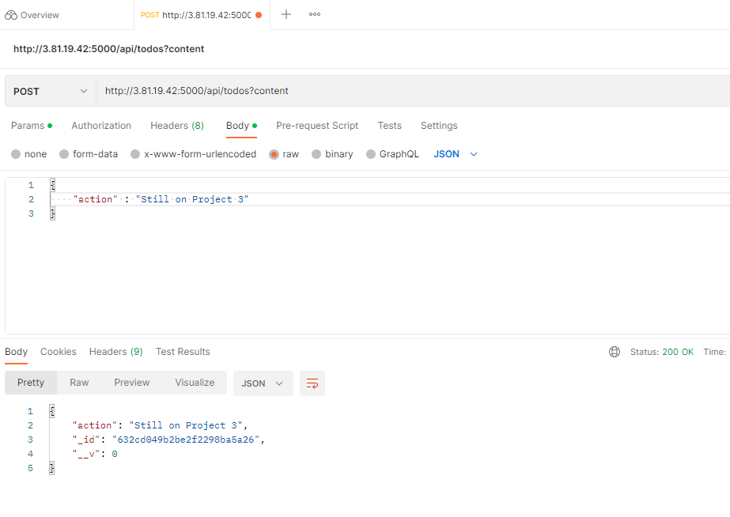

# Project-3 Documentations

## MERN Stack Implementations

### Step 1 - Backend Configuration

### Commands

- sudo apt update (Update Ubuntu)
- sudo apt upgrade (Ugrade Ubuntu)
- curl -fsSL https://deb.nodesource.com/setup_18.x | sudo -E bash - (Locate Node.js software in Ubuntu repositories)
- sudo apt-get install -y nodejs (Install Node.js and npm)
- node -v (Verify node installation)
- npm -v (Verify npm installation)
- mkdir Todo (Create a Todo directory)
- ls (Vverify Todo directory is created)
- npm init (Initialize peoject and create package.json file)

## Install Expressjs

### Commands

- npm install express (Install expressjs)
- touch index.js (create index.js file)
- ls (Confirm index.js file is created)
- npm install dotenv (Install dotenv module)
- vim index.js (Open index.js file)
- const express = require('express');
require('dotenv').config();

const app = express();

const port = process.env.PORT || 5000;

app.use((req, res, next) => {
res.header("Access-Control-Allow-Origin", "\*");
res.header("Access-Control-Allow-Headers", "Origin, X-Requested-With, Content-Type, Accept");
next();
});

app.use((req, res, next) => {
res.send('Welcome to Express');
});

app.listen(port, () => {
console.log(`Server running on port ${port}`)
}); (command for index.js file)
- :wqa (save code quit and exit index.js file)
- node index.js (confirm your server is running on port 5000)

- confirmation of servers public IP with port 5000 on browser

- 

- mkdir routes (create routes directory)
- cd routes (change directory to routes)
- touch api.js (create api.js file)
- vim api.js (open api.js file)
- const express = require ('express');
const router = express.Router();

router.get('/todos', (req, res, next) => {

});

router.post('/todos', (req, res, next) => {

});

router.delete('/todos/:id', (req, res, next) => {

})

module.exports = router; (paste this code in api.js file)
- :wqa (save code quite and exit api.js file)

- 

## Models

### Commands

- cd .. (Change directory back to Todo)
- npm install mongoose (Install mongoose)
- mkdir models (Create a new folder called models)
- cd models (Change directory to models)
- touch todo.js (Creaate a todo.js file inside models)
- vim todo.js (Open todo.js file)
- const mongoose = require('mongoose');
const Schema = mongoose.Schema;

//create schema for todo
const TodoSchema = new Schema({
action: {
type: String,
required: [true, 'The todo text field is required']
}
})

//create model for todo
const Todo = mongoose.model('todo', TodoSchema);

module.exports = Todo; (Paste in todo.js file)
- :wqa (save code quit and exit todo.js file)
- vim api.js (Open api.js file)
- :%d (Delete content in the api.js file)
- const express = require ('express');
const router = express.Router();
const Todo = require('../models/todo');

router.get('/todos', (req, res, next) => {

//this will return all the data, exposing only the id and action field to the client
Todo.find({}, 'action')
.then(data => res.json(data))
.catch(next)
});

router.post('/todos', (req, res, next) => {
if(req.body.action){
Todo.create(req.body)
.then(data => res.json(data))
.catch(next)
}else {
res.json({
error: "The input field is empty"
})
}
});

router.delete('/todos/:id', (req, res, next) => {
Todo.findOneAndDelete({"_id": req.params.id})
.then(data => res.json(data))
.catch(next)
})

module.exports = router; (Copy and past in api.js file)
- :wqa (save quit and exit api.js file)

- 

## MongoDB Database

### Commands

- cd Todo (change directory to Todo)
- touch .env (Create .env file)
- vi .env (open .env file)
- DB = 'mongodb+srv://<username>:<password>@<network-address>/<dbname>?retryWrites=true&w=majority' (Copy and paste in .env file and change the paramenters as created on mongodb database)
- vim index.js (Open the index,js file)
- :%d (press esc and delete the content of index.js file)
- const express = require('express');
const bodyParser = require('body-parser');
const mongoose = require('mongoose');
const routes = require('./routes/api');
const path = require('path');
require('dotenv').config();

const app = express();

const port = process.env.PORT || 5000;

//connect to the database
mongoose.connect(process.env.DB, { useNewUrlParser: true, useUnifiedTopology: true })
.then(() => console.log(`Database connected successfully`))
.catch(err => console.log(err));

//since mongoose promise is depreciated, we overide it with node's promise
mongoose.Promise = global.Promise;

app.use((req, res, next) => {
res.header("Access-Control-Allow-Origin", "\*");
res.header("Access-Control-Allow-Headers", "Origin, X-Requested-With, Content-Type, Accept");
next();
});

app.use(bodyParser.json());

app.use('/api', routes);

app.use((err, req, res, next) => {
console.log(err);
next();
});

app.listen(port, () => {
console.log(`Server running on port ${port}`)
}); (Press i then copy and paste this new content in the index.js file)
- :wqa (save quit and exit index.js file)
- node index.js (Start your server)

### Testing Backend Code without Frontend using RESTful API

## Step 2 – Frontend creation

### Commands

- npx create-react-app client (Create a folder called client in Todo directory)
- npm install concurrently --save-dev (Install concurretly as a dependency)
- npm install nodemon --save-dev (Install nodemom to run and monitor the server)
- cd Todo (Change directory to Todo)
- vi package.json (Open the package.json file)
- "scripts": {
"start": "node index.js",
"start-watch": "nodemon index.js",
"dev": "concurrently \"npm run start-watch\" \"cd client && npm start\""
}, (Copy and paste in a portion of the file content)
- :wqa (save quit and exit file)
- cd client (Change directory to client folder)
- vi package.json (Open package.json file)
- "proxy": "http://localhost:5000", (Copy and paste in file)
- :wqa (save quit and exit file)
- cd Todo (Go to Todo directory)
- npm run dev (To run your app on localhost with port 3000 after adding an inbound rule in your security group in EC2)

- 

- cd client (Go to client directory)
- cd src (Go to src directory)
- mkdir components (Create a directory called components)
- cd components (Go to the components directory)
- touch Input.js ListTodo.js Todo.js (Create 3 files named Inout.js ListTodo.js and Todo.js)
- vi Input.js (Open Inout.js file)
- import React, { Component } from 'react';
import axios from 'axios';

class Input extends Component {

state = {
action: ""
}

addTodo = () => {
const task = {action: this.state.action}

    if(task.action && task.action.length > 0){
      axios.post('/api/todos', task)
        .then(res => {
          if(res.data){
            this.props.getTodos();
            this.setState({action: ""})
          }
        })
        .catch(err => console.log(err))
    }else {
      console.log('input field required')
    }

}

handleChange = (e) => {
this.setState({
action: e.target.value
})
}

render() {
let { action } = this.state;
return (

<input type="text" onChange={this.handleChange} value={action} />
<button onClick={this.addTodo}>add todo</button>

)
}
}

export default Input (Copy and paste in file)
- :wqa (Save quit and exit file)
- cd .. (Go to src foler)
- cd .. (Go to clients folder)
- npm install axios (Install Axios)
- cd src/components (Go to Components directory)
- vi ListTodo.js (Open ListTodo.js file)
- import React from 'react';

const ListTodo = ({ todos, deleteTodo }) => {

return (
<ul>
{
todos &&
todos.length > 0 ?
(
todos.map(todo => {
return (
<li key={todo._id} onClick={() => deleteTodo(todo._id)}>{todo.action}</li>
)
})
)
:
(
<li>No todo(s) left</li>
)
}
</ul>
)
}

export default ListTodo (Copy and paste the code)
- :wqa (save quit and exit file)
- vi Todo.js (Open Todo.js file)
- import React, {Component} from 'react';
import axios from 'axios';

import Input from './Input';
import ListTodo from './ListTodo';

class Todo extends Component {

state = {
todos: []
}

componentDidMount(){
this.getTodos();
}

getTodos = () => {
axios.get('/api/todos')
.then(res => {
if(res.data){
this.setState({
todos: res.data
})
}
})
.catch(err => console.log(err))
}

deleteTodo = (id) => {

    axios.delete(`/api/todos/${id}`)
      .then(res => {
        if(res.data){
          this.getTodos()
        }
      })
      .catch(err => console.log(err))

}

render() {
let { todos } = this.state;

    return(
      

        <h1>My Todo(s)</h1>
        <Input getTodos={this.getTodos}/>
        <ListTodo todos={todos} deleteTodo={this.deleteTodo}/>
      

    )

}
}

export default Todo; (Copy and paste in file)
- :wqa (save quit and exit file)
- cd .. (Go back to src folder)
- vi App.js (Open App.js file)
- import React from 'react';

import Todo from './components/Todo';
import './App.css';

const App = () => {
return (

<Todo />

);
}

export default App; (Copy and paste in file)
- :wqa (save quit and exit file)
- vi App.css (Open App,css file)
- .App {
text-align: center;
font-size: calc(10px + 2vmin);
width: 60%;
margin-left: auto;
margin-right: auto;
}

input {
height: 40px;
width: 50%;
border: none;
border-bottom: 2px #101113 solid;
background: none;
font-size: 1.5rem;
color: #787a80;
}

input:focus {
outline: none;
}

button {
width: 25%;
height: 45px;
border: none;
margin-left: 10px;
font-size: 25px;
background: #101113;
border-radius: 5px;
color: #787a80;
cursor: pointer;
}

button:focus {
outline: none;
}

ul {
list-style: none;
text-align: left;
padding: 15px;
background: #171a1f;
border-radius: 5px;
}

li {
padding: 15px;
font-size: 1.5rem;
margin-bottom: 15px;
background: #282c34;
border-radius: 5px;
overflow-wrap: break-word;
cursor: pointer;
}

@media only screen and (min-width: 300px) {
.App {
width: 80%;
}

input {
width: 100%
}

button {
width: 100%;
margin-top: 15px;
margin-left: 0;
}
}

@media only screen and (min-width: 640px) {
.App {
width: 60%;
}

input {
width: 50%;
}

button {
width: 30%;
margin-left: 10px;
margin-top: 0;
}
} (Copy and paste code in file)
- :wqa (Save quit and exit)
- vim index.css (Open index.css file)
- body {
margin: 0;
padding: 0;
font-family: -apple-system, BlinkMacSystemFont, "Segoe UI", "Roboto", "Oxygen",
"Ubuntu", "Cantarell", "Fira Sans", "Droid Sans", "Helvetica Neue",
sans-serif;
-webkit-font-smoothing: antialiased;
-moz-osx-font-smoothing: grayscale;
box-sizing: border-box;
background-color: #282c34;
color: #787a80;
}

code {
font-family: source-code-pro, Menlo, Monaco, Consolas, "Courier New",
monospace;
} (Copy and paste in file)
- :wqa (save quit and exit file)
- cd ../.. (Go back to Todo directory)
- npm run dev 

- 

